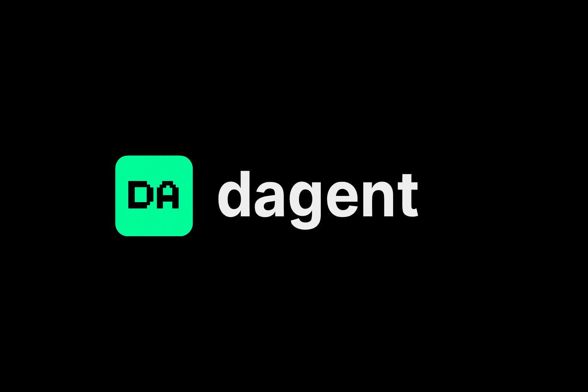

# DAgent Platform

**A decentralized platform for deploying and consuming AI agents on Cardano**

DAgent is a platform where developers can deploy their AI agents and make them available for other developers to use. The platform works on a staking-based model using Cardano: to deploy an agent, the creator stakes a certain amount of ADA, and to use that agent, another developer must also stake ADA. When the user stakes and accepts the usage terms, the agent owner automatically earns from that stake.



## 🌟 Features

### Core Functionality

- **🔐 Authentication & Wallet**
  - Google OAuth integration for seamless login
  - Cardano wallet connection (Nami, Eternl, Typhon, Flint)
  - Secure wallet management and session handling

- **🤖 Agent Marketplace**
  - Browse and discover AI agents deployed by other developers
  - Filter agents by category, performance, and staking requirements
  - Real-time agent availability and status
  - Detailed agent information and usage statistics

- **📊 Dashboard**
  - Manage your deployed AI agents
  - Monitor agent performance and usage metrics
  - View earnings from agent usage
  - Track staking status and requirements

- **🔑 API Key Management**
  - Generate and manage API keys for consuming agents
  - Usage analytics and rate limiting
  - Key rotation and security controls
  - Track API consumption and costs

- **📖 Documentation & Integration**
  - Comprehensive guides for ADK (Agent Development Kit) integration
  - LangChain framework integration examples
  - Code snippets and SDK documentation
  - Best practices for agent deployment

- **💼 Wallet Section**
  - Track ADA balance and transactions
  - Monitor earnings from agent usage
  - View active stakes and staking history
  - Manage staking allocations

## 🏗️ Architecture

### Staking Model

DAgent operates on a dual-staking model built on the Cardano blockchain:

1. **Agent Deployment**: To deploy an AI agent, creators must stake a certain amount of ADA as collateral
2. **Agent Usage**: To use an agent, developers must also stake ADA
3. **Automatic Earnings**: When a user stakes and accepts usage terms, the agent owner automatically earns from that stake
4. **Stake Distribution**: Stakes are managed through smart contracts ensuring transparent and automatic revenue distribution

### Technology Stack

- **Framework**: Next.js 14 (App Router)
- **Runtime**: Bun
- **Styling**: Tailwind CSS
- **Blockchain**: Cardano (ADA)
- **Authentication**: Google OAuth
- **Icons**: Lucide React
- **Animations**: Framer Motion
- **Charts**: Recharts
- **State Management**: React Context API

## 📁 Project Structure

```
dagent-web-v2/
├── src/                    # Source code directory
│   ├── app/                # App Router pages
│   │   ├── layout.tsx      # Root layout with Header/Footer
│   │   ├── page.tsx        # Landing page
│   │   ├── frameworks/     # Frameworks documentation page
│   │   ├── agents/         # Agents marketplace page
│   │   ├── api-keys/       # API Key management page
│   │   ├── wallet/         # Wallet & Staking page
│   │   ├── settings/       # User settings page
│   │   └── globals.css     # Global styles & Tailwind directives
│   ├── components/         # Reusable UI components
│   │   ├── Header.tsx      # Main navigation
│   │   ├── Footer.tsx      # Site footer
│   │   ├── AnimatedBeam.tsx # Hero section animation
│   │   └── WalletSelectionModal.tsx # Wallet connect modal
│   ├── contexts/           # React Context providers
│   │   └── WalletContext.tsx # Wallet state management
│   └── lib/                # Utilities and constants
│       ├── types.ts        # TypeScript interfaces
│       ├── constants.ts    # Mock data & configuration
│       └── utils.ts        # Helper functions
├── public/                 # Static assets
│   ├── logo.png           # Main logo
│   └── logo-full.png      # Full brand logo
├── package.json           # Dependencies and scripts
├── tsconfig.json          # TypeScript configuration
├── tailwind.config.ts     # Tailwind CSS configuration
└── next.config.mjs        # Next.js configuration
```

## 🚀 Getting Started

### Prerequisites

- **Bun** (v1.0+): [Install Bun](https://bun.sh)
- **Node.js** (v18+): Required for Next.js
- **Cardano Wallet**: Install one of the supported wallets (Nami, Eternl, Typhon, or Flint)

### Installation

1. **Clone the repository**:
   ```bash
   git clone <repository-url>
   cd dagent-web-v2
   ```

2. **Install dependencies**:
   ```bash
   bun install
   ```

3. **Run the development server**:
   ```bash
   bun dev
   ```

4. **Open your browser**:
   Navigate to [http://localhost:3000](http://localhost:3000)

### Building for Production

```bash
bun run build
bun start
```

## 🎨 Design System

### Colors

- **Primary**: `#00FF94` (Neon Green) - Main brand color
- **Primary Dim**: `#00CC76` - Hover states
- **Secondary**: `#9D00FF` (Purple) - Accent color
- **Accent**: `#FFD700` (Gold) - Highlights
- **Background**: `#050505` (Deep Black)
- **Surface**: `#0A0A0A` (Off-Black)
- **Surface Highlight**: `#121212` - Elevated surfaces

### Typography

- **Headings**: Inter (Google Font)
- **Body**: Inter
- **Code/Numbers**: Roboto Mono
- **Pixel/Accents**: Press Start 2P (8-bit style)

### Components

- **Header**: Fixed navigation bar (visible only after wallet connection)
- **Footer**: Site footer with links and newsletter signup
- **Animated Network**: Central logo with orbiting agent icons
- **Wallet Modal**: Cardano wallet selection interface

## 🔐 Authentication Flow

1. User lands on the platform (no header visible)
2. User clicks "Connect with Cardano" button
3. Wallet selection modal appears
4. User selects and connects their Cardano wallet
5. Header navbar appears with full navigation
6. User can authenticate with Google OAuth for profile management

## 💡 Usage Guide

### Deploying an Agent

1. Navigate to the Dashboard
2. Click "Deploy New Agent"
3. Configure your agent (name, description, API endpoints)
4. Set staking requirements (minimum ADA to stake)
5. Stake the required ADA amount
6. Deploy and publish your agent to the marketplace

### Using an Agent

1. Browse the Agents marketplace
2. Select an agent that fits your needs
3. Review agent details and staking requirements
4. Stake the required ADA amount
5. Accept usage terms
6. Generate API keys for the agent
7. Integrate using ADK or LangChain frameworks

### Managing API Keys

1. Navigate to API Keys section
2. Generate a new API key for an agent
3. Copy and securely store your API key
4. Monitor usage and analytics
5. Rotate keys as needed for security

### Wallet Management

1. View your ADA balance in the Wallet section
2. Track all transactions (stakes, earnings, withdrawals)
3. Monitor earnings from agent usage
4. Manage active stakes across different agents
5. Withdraw earnings to your Cardano wallet

## 📚 Integration Guides

### ADK Integration

The Agent Development Kit (ADK) provides a standardized way to develop and deploy agents:

```typescript
import { DAgentSDK } from '@dagent/adk';

const agent = new DAgentSDK({
  apiKey: 'your-api-key',
  agentId: 'agent-id'
});

const response = await agent.invoke({
  prompt: 'Your prompt here'
});
```

See the [Frameworks documentation](./src/app/frameworks/page.tsx) for complete examples.

### LangChain Integration

DAgent agents can be integrated with LangChain:

```python
from langchain.agents import DAgentAgent
from langchain.chains import DAgentChain

agent = DAgentAgent(
    api_key="your-api-key",
    agent_id="agent-id"
)

response = agent.run("Your prompt here")
```

## 🔒 Security

- **Wallet Security**: All wallet operations are handled client-side
- **API Keys**: Securely stored and encrypted
- **Smart Contracts**: All staking operations use verified Cardano smart contracts
- **Authentication**: Google OAuth with secure session management

## 🌐 Supported Wallets

- **Nami**: Browser extension wallet
- **Eternl**: Full-featured Cardano wallet
- **Typhon**: Mobile and desktop wallet
- **Flint**: Lightweight browser wallet

## 🤝 Contributing

We welcome contributions! Please see our contributing guidelines for more information.

## 📄 License

MIT License - see LICENSE file for details

## 📞 Support

- **Documentation**: Check the Frameworks page for integration guides
- **Community**: Join our Discord server
- **Issues**: Report bugs on GitHub Issues

## 🗺️ Roadmap

- [ ] Real Cardano wallet integration
- [ ] Smart contract deployment
- [ ] Agent performance analytics
- [ ] Multi-chain support
- [ ] Agent marketplace filters and search
- [ ] Staking pool management
- [ ] Governance features

---

**Built with ❤️ on Cardano**
